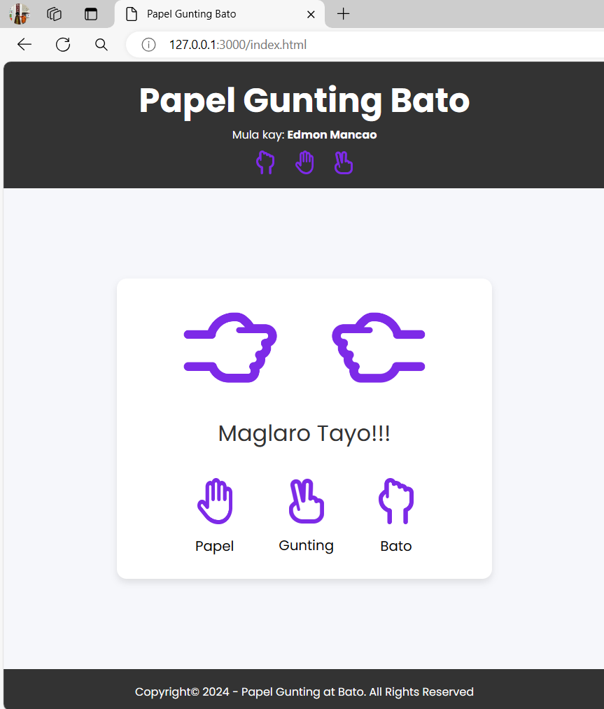

# Papel Gunting Bato

## HTML and CSS for this Project

Here's the worldwide world game we need to create. Actually, this game has a competition and here's the link I've provide to show more [info](https://wrpsa.com/rock-paper-scissors-tournaments/). I made this game in Filipino version, that's why the title is the Filipino or Tagalog word. The title of the game heres are follows: The "Papel" means "Paper", The "Gunting" means "Scissor", and the "Bato" means "Stone".

First We need to create is the three files for the project which is for `html`, the `CSS`, and the `JavaScript` file. And provide the image for the project.

<figure>
    
    <figcaption>Here's the project file you create this project</figcaption>
</figure>

## Create Boilerplate for HTML File

After you create the `index.html` html file, create the boilerplate for this file for saving time to type all of if using **Emmet** method like this. Type (**!**) if the file is blank let met show you.

<figure>
    
    <figcaption>Simply type ! to create boilerplate or template html for saving time purposes</figcaption>
</figure>

Next is to type the `<header></header>` and the `<footer></footer>` for HTML file under the `<body></body>` tag.

```
<body>
    <header>
    </header>
    <footer>
    </footer>
</body>
```

Add the `h1` heading inside of `<header></header>` for the title called **Papel Gunting Bato** and the Author of the game using `p` paragraph tag accompanied with `b` tag means (bold).

```
<body>
    <header>
        <h1>Papel Gunting Bato</h1>
        <p>Mula kay: <b>Edmon Mancao</b></p>
    </header>
    <footer>
    </footer>
</body>
```

<figure>
    
    <figcaption>You see the highlighted blue is the header with h1, p and b tags.</figcaption>
</figure>

For the footer, type the following using the `p` paragraph tag: **<p>Copyright&copy; 2024 - Papel Gunting at Bato. All Rights Reserved</p>**

```
<body>
    <header>
        <h1>Papel Gunting Bato</h1>
        <p>Mula kay: <b>Edmon Mancao</b></p>
    </header>
    <footer>
        <p>Copyright&copy; 2024 - Papel Gunting at Bato. All Rights Reserved</p>
    </footer>
</body>
```
<figure>
    
    <figcaption>The highlighted blue is the footer</figcaption>
</figure>

Another `div` tag for the images inside of the header with the class named `.img-container`.

```
<body>
    <header>
        <h1>Papel Gunting Bato</h1>
        <p>Mula kay: <b>Edmon Mancao</b></p>
        <div class="img-container">
            
            
            
        </div>
    </header>
    <footer>
        <p>Copyright&copy; 2024 - Papel Gunting at Bato. All Rights Reserved</p>
    </footer>
</body>
```

Next, is to apply the three images as a part of the `header` of the game.

```
<body>
    <header>
        <h1>Papel Gunting Bato</h1>
        <p>Mula kay: <b>Edmon Mancao</b></p>
        <div class="img-container">
            
            
            
        </div>
    </header>
    <footer>
        <p>Copyright&copy; 2024 - Papel Gunting at Bato. All Rights Reserved</p>
    </footer>
</body>
```

<figure>
    
    <figcaption>Here's the image of the heder and we style it to organize this.</figcaption>
</figure>

Let's link the CSS file to the `<head></head>` of html project.

This HTML code is linking an external CSS file named "style.css" to the current HTML document. The `rel` attribute specifies the relationship between the current document and the linked document, in this case, it is a stylesheet. The `href` attribute specifies the path to the CSS file.

```
<head>
    <meta charset="UTF-8">
    <meta name="viewport" content="width=device-width, initial-scale=1.0">
    <title>Papel Gunting Bato</title>
    <link rel="stylesheet" href="style.css">
</head>
```

Go to CSS file and use the `@import url()` command to use the font from **Google Fonts**

Use this font **Poppins** and **Ubuntu**.

```
https://fonts.googleapis.com/css2?family=Poppins:ital,wght@0,100;0,200;0,300;0,400;0,500;0,600;0,700;0,800;0,900;1,100;1,200;1,300;1,400;1,500;1,600;1,700;1,800;1,900&family=Ubuntu+Sans+Mono:ital,wght@0,400..700;1,400..700&display=swap
```

In CSS file using `@import url()` this code uses the `@import` rule in CSS to import Google Fonts. It imports the font families `Poppins` and `Ubuntu Sans Mono` with various weights and styles from Google Fonts and applies them to the webpage. The `display=swap` part of the URL ensures that the text is initially displayed with a fallback font until the Google Fonts are loaded.

```
@import url(https://fonts.googleapis.com/css2?family=Poppins:ital,wght@0,100;0,200;0,300;0,400;0,500;0,600;0,700;0,800;0,900;1,100;1,200;1,300;1,400;1,500;1,600;1,700;1,800;1,900&family=Ubuntu+Sans+Mono:ital,wght@0,400..700;1,400..700&display=swap);
```

Next is to style global means (*) for the entire webpage.

In CSS code sets some global styles for the entire webpage.

- `padding: 0`; and margin: 0; remove any default padding and margin that elements may have.
- `box-sizing`: border-box; ensures that the width and height properties include the padding and border, not just the content.
- `font-family`: "Poppins", sans-serif; sets the font family to "Poppins" if available, otherwise it falls back to a generic sans-serif font.

```
* {
    padding: 0;
    margin: 0;
    box-sizing: border-box;
    font-family: "Poppins", sans-serif;
}
```

<figure>
    
    <figcaption>Observe the font of h1, the footer, and the paragraph (p) tag.</figcaption>
</figure>


Let's style the `h1`. This CSS code sets the font size of all `<h1>` elements to 3 times the size of the root (the `html` which is `16 pixels`) element's font size. 

When you use `h1 { font-size: 3rem; }`, the font size of the `<h1>` elements will be `48 pixels` by default (assuming the `root` element's font size is `16 pixels`). This is because rem is a unit of measurement that represents the font size of the root element. So 3rem is equivalent to 3 times the font size of the root element, which is `48 pixels` in this case.

```
h1 {
    font-size: 3rem;
}
```

<figure>
    
    <figcaption>The font of h1 is 3 times of the value of html root which is 48 pixels</figcaption>
</figure>


Style the `header` of webpage. This CSS code styles the `header` element on a webpage:

- `width`: 100%; sets the width of the header to 100% of its parent element's width.

- `text-align`: center; centers the content of the header horizontally.

- `padding`: 20px 0; adds 20 pixels of padding to the top and bottom of the header, and 0 pixels of padding to the left and right.

- `background`: #333; sets the background color of the header to a dark gray (#333).

- `color`: #fff; sets the text color of the header to white.

- `font-family`: "Ubuntu", sans-serif; sets the font family of the header text to "Ubuntu", with a fallback to a generic sans-serif font.

```
header {
    width: 100%;
    text-align: center;
    padding: 20px 0;
    background: #333;
    color: #fff;
    font-family: "Ubuntu", sans-serif;
}
```

<figure>
    
    <figcaption>The darker you see is the header with the color of #333 (blackish color)</figcaption>
</figure>

Style the `` with the class name `.game-img`. In CSS code defines a style for elements with the class name "game-img". It sets the `width` and `height` of these elements to `3%` of their parent element's width and height respectively. It also adds a `margin` of `10 pixels` to the top, `15 pixels` to the right, and `0 pixels` to the bottom.

```
.game-img {
    width: 3%;
    height: 3%;
    margin: 10px 15px 0;
}
```

<figure>
    
    <figcaption>You see the margin of the one of the image of the game as a part of title of the game</figcaption>
</figure>

Next, is to style to `container` for the layout of images. Then, let's use the `Flexbox`. This CSS code styles an element with the class name `.img-container` to use `flexbox`. It horizontally `centers` its children elements and vertically aligns them in the `center`.

```
.img-container {
    display: flex;
    justify-content: center;
    align-items: center;
}
```

<figure>
    
    <figcaption>You see or observe the images was aligned using flexbox</figcaption>
</figure>


Last style is the `footer`. In this CSS code styles the `<footer>` element. It sets the `width` to `100%` of its container, `centers` the `text` within the footer, adds `20 pixels` of `padding` at the top and bottom, sets the `background` color to `#333` (a dark gray), and sets the text color to white.

```
footer {
    width: 100%;
    text-align: center;
    padding: 20px 0;
    background: #333;
    color: #fff;
}
```

<figure>
    
    <figcaption>Here's the footer highlighed in the dark</figcaption>
</figure>

Now, create the `section` between the `<header></header>` and the `<footer></footer>` with the class name of `container`. This code creates a section element with a class attribute set to "container". The class "container" is typically used for styling purposes like centering content or applying specific styles to elements within the section.

```
<body>
    <header>
        <!-- snip -->
    </header>

    <section class="container"></section>
    
    <footer>
        <!-- snip -->
    </footer>
</body>
```

This code creates a section in the HTML document with a class attribute named "container". Inside this section, there is a division element with a class attribute named "result_field".

```
<body>
    <header>
        <!-- snip -->
    </header>

    <section class="container">
        <div class="result_field">  
        </div>
    </section>

    <footer>
        <!-- snip -->
    </footer>
</body>
```

Another `div` under the `.result_field` which is `.result_images` is a class name. In this HTML code represents a structure for a webpage. It consists of a container element with the class "body-container" that contains a section element with the class "container". Inside the section, there is a division element with the class "result_field". This division contains another division element with the class "result_images". The purpose of this structure is to organize and contain different elements related to a game result or user interface.

```
<body>
    <header>
        <!-- snip -->
    </header>

    <div class="body-container">
        <section class="container">
            <div class="result_field">
                <div class="result_images">
                </div> 
            </div>
        </section>
    </div>

    <footer>
        <!-- snip -->
    </footer>
</body>
```

Now, create the `span` for the image result of the game. We need create two `span` without an `img` first. This code snippet represents a structure for a webpage. It consists of a container element with the class "body-container" that contains a section element with the class "container". Inside the section, there is a division element with the class "result_field". This division contains another division element with the class "result_images". Inside the "result_images" division, there are two span elements with the classes "user_result" and "cpu_result". The purpose of this structure is to organize and contain different elements related to a game result or user interface.

```
<body>
    <header>
        <!-- snip -->
    </header>

    <section class="container">
        <div class="result_field">
            <span class="user_result"></span>
            <span class="cpu_result"></span>  
        </div>
    </section>

    <footer>
        <!-- snip -->
    </footer>
</body>
```

Next, apply the sample image result for `computer` and the `player` for the game and see the result of the webpage after this. This code represents a section of an HTML webpage. It creates a container with the class "container". Inside the container, there is a division element with the class "result_field". This division contains another division element with the class "result_images". Inside the "result_images" division, there are two span elements with the classes "user_result" and "cpu_result". Each span element contains an image element with a source (src) attribute pointing to an image file located in the "images" directory. The "alt" attribute provides alternative text for the images. The purpose of this code is to organize and contain different elements related to a game result or user interface, specifically displaying the result of the game between a player and a CPU, with images representing the results.

```
<body>
    <header>
        <!-- snip -->
    </header>
    <section class="container">
        <div class="result_field">
            <div class="result_images">
                <span class="user_result">
                    
                </span>
                <span class="cpu_result">
                    
                </span>
            </div> 
        </div>
    </section>
    </div>

    <footer>
        <!-- snip -->
    </footer>
```

<figure>
    
    <figcaption>Here's the rock for the player (in the first) and other one is CPU is rock as well.</figcaption>
</figure>

Now, the last is add another `div` as the body of the `section` for the game which. 

This HTML code represents a structure for a webpage. It consists of a container element with the class "body-container" that contains a section element with the class "container". Inside the section, there is a division element with the class "result_field". This division contains another division element with the class "result_images". Inside the "result_images" division, there are two span elements with the classes "user_result" and "cpu_result". Each span element contains an image element with a source (src) attribute pointing to an image file located in the "images" directory. The "alt" attribute provides alternative text for the images. The purpose of this structure is to organize and contain different elements related to a game result or user interface, specifically displaying the result of the game between a player and a CPU, with images representing the results.

```
<body>
    <header>
        <!-- snip -->
    </header>

    <div class="body-container">
        <section class="container">
            <div class="result_field">
                <div class="result_images">
                    <span class="user_result">
                        
                    </span>
                    <span class="cpu_result">
                        
                    </span>
                </div> 
            </div>
        </section>
    </div>

    <footer>
        <!-- snip -->
    </footer>
</body>
```

First is to resize te image of the game. This CSS targets all `img` elements inside an element with the class `result_images` and sets their width to `100px`.

```
.result_images img {
    width: 100px;
}
```

<figure>
    
    <figcaption>Here's the resized image of the game</figcaption>
</figure>

Next, is to style the container of the game which is the `body-container` class. This CSS styles an element with the class .body-container. It sets the height to cover the full height of the viewport, aligns the contents vertically and horizontally, and gives it a light blue background color.

```
.body-container {
    height: 100vh;
    display: flex;
    align-items: center;
    justify-content: center;
    background: #f6f7fb;
}
```

<figure>
    
    <figcaption>You see the two hands in the game is in the middle. Afterwards, I change 74vh</figcaption>
</figure>

Next, style is the `.container` class of the game. It has a children class name `result_field` and `result_images`.

```
.container {
    padding: 2rem 7rem;
    border-radius: 14px;
    background: #fff;
    box-shadow: 0 5px 10px rgba(0, 0, 0, 0.1);
} 
```

<figure>
    
    <figcaption>The container appears in the game.</figcaption>
</figure>

Style the `.result_images` class for the image of the game. This code styles an element with the class .result_images by making it a flex container and setting a gap of 7rem between the columns within it.

```
.result_images {
    display: flex;
    column-gap: 7rem;
}
```

<figure>
    
    <figcaption></figcaption>
</figure>

Let's rotate the player's hands in this game and how to do it? This CSS code targets an image inside an element with the class name `.user_result` and rotates it by 90 degrees clockwise.

```
.user_result img {
    transform: rotate(90deg);
}
```

<figure>
    
    <figcaption></figcaption>
</figure>

Let's rotate the computer's hands in this game and how to do it? This CSS code targets an image inside an element with the class `.cpu_result` and applies two transformations to it: it rotates it -90 degrees clockwise and flips it vertically.

```
.cpu_result img {
    transform: rotate(-90deg) rotateY(180deg);
}
```

<figure>
    
    <figcaption></figcaption>
</figure>

Create another `div` after the `.result_images` class. This HTML code represents a div element with the class name "result" that contains the text "Let's Play!!!" inside it.

```
<body>
    <header>
        <!-- snip -->
    </header>

    <div class="body-container">
        <section class="container">
            <div class="result_field">
                <div class="result_images">
                    <span class="user_result">
                        
                    </span>
                    <span class="cpu_result">
                        
                    </span>
                </div> 
                <div class="result">Let's Play!!!</div>
            </div>
        </section>
    </div>

    <footer>
        <!-- snip -->
    </footer>
</body>
```

<figure>
    
    <figcaption>The result without style for div with ".result" class</figcaption>
</figure>

Next is to style the `.result` class in `div` tag. This CSS code defines the styling for elements with the class name `.result`. It `centers` the `text`, sets the `font size` to `2rem`, sets the text `color` to `#333` (a dark gray), and adds a `top margin` of `1.5rem`.

```
.result {
    text-align: center;
    font-size: 2rem;
    color: #333;
    margin-top: 1.5rem;
}
```

<figure>
    
    <figcaption>The result with style for div with "result" class name</figcaption>
</figure>

Create another `div` for the options image for the player of the game. This HTML code represents a `div` element with the class name "option_images". It is an empty container that can be styled or populated with content using CSS or JavaScript.

```
    <div class="body-container">
        <section class="container">
            <div class="result_field">
                <div class="result_images">
                    <span class="user_result">
                        
                    </span>
                    <span class="cpu_result">
                        
                    </span>
                </div> 
                <div class="result">Let's Play!!!</div>
            </div>

            <div class="option_images"></div>
        </section>
    </div>
```

Create the `span` tag inside of `.option_image` and attach the image for the result. This HTML code creates a `div` element with the class name "option_images". Inside this `div`, there is a span element with the class name "option_image". Inside the `span`, there is an `img` element that displays an image with the source "./images/rock.png" and an alternate text of "The rock".

```
    <div class="body-container">
        <section class="container">
            <div class="result_field">
                <div class="result_images">
                    <span class="user_result">
                        
                    </span>
                    <span class="cpu_result">
                        
                    </span>
                </div> 
                <div class="result">Let's Play!!!</div>
            </div>

            <div class="option_images">
                <span class="option_image">
                    
                </span>
            </div>
        </section>
    </div>
```

Shrink the size of image in `option_image` class for the game. This CSS code targets the `img` elements that are descendants of elements with the class `option_image`. It sets the `width` of these img elements to `50px`.

```
.option_image img {
    width: 50px;
}
```

<figure>
    
    <figcaption>Here's the one hand choices for the player and let's add this</figcaption>
</figure>

Let's Add another choice and put some text in Tagalog every image. Atleast you learn the basic Filipino language in this game. This HTML code represents a container with options for a game. It includes images of paper, scissors, and rock, each followed by corresponding text labels in a structured manner.

```
<div class="body-container">
        <section class="container">
            <div class="result_field">
                <div class="result_images">
                    <span class="user_result">
                        
                    </span>
                    <span class="cpu_result">
                        
                    </span>
                </div> 
                <div class="result">Let's Play!!!</div>
            </div>

            <div class="option_images">
                <span class="option_image">
                    
                    <p>Papel</p>
                </span>
                <span class="option_image">
                    
                    <p>Gunting</p>
                </span>
                <span class="option_image">
                    
                    <p>Bato</p>
                </span>
            </div>
        </section>
    </div>
```

<figure>
    
    <figcaption>The result of three hand but without alignment of this image choice for player.</figcaption>
</figure>

Style the `.option_image` for the game and change the **Let's Play!** text to **Maglaro Tayo!!!**. This code snippet styles an element with the class name .option_images. It makes the element a `flex container`, aligns its children vertically centered, adds a `top margin` of `2.5rem`, and distributes the space between its children elements horizontally.

```
.option_images {
    display: flex;
    align-items: center;
    margin-top: 2.5rem;
    justify-content: space-between;
}
```

<figure>
    
    <figcaption>You see the alignment of the hands of the choices for the players but it's not done yet.</figcaption>
</figure>

Next is for `.option_image` class which is for the images of the game alignments. This CSS code styles an element with the class name `.option_image`. It makes the element a flex container and aligns its children vertically centered. The `flex-direction: column;` property stacks the children elements vertically, and the `align-items: center;` property centers the children elements horizontally.

```
.option_image {
    display: flex;
    flex-direction: column;
    align-items: center;
}
```

<figure>
    
    <figcaption>The alignment is not yet done but we need to style the paragraph or `p` tag.</figcaption>
</figure>

Let's style for the `p` tag or paragraph tab for this game. This code targets the `p` elements inside elements with the class name `.option_image`. It sets the `font size` to `1.235rem`, adds a `top margin` of `1rem`, and `disables` `pointer events` on those p elements.

```
.option_image p {
    font-size: 1.235rem;
    margin-top: 1rem;
    pointer-events: none;
}
```

<figure>
    
    <figcaption></figcaption>
</figure>

Let's udpate the `.option_image` class. This CSS code snippet defines the styling for elements with the class name `.option_image`. It makes the element a flex container and aligns its children vertically centered. The `flex-direction: column;` property stacks the children elements vertically, and the `align-items: center;` property centers the children elements horizontally. The `pointer-events: none;` property disables pointer events on the element, making it non-interactive. The `opacity: 0.5;` property sets the opacity of the element to 0.5, making it semi-transparent. The `transition: opacity 0.3s ease;` property applies a smooth transition effect to the opacity change over a duration of 0.3 seconds.

```
.option_image {
    display: flex;
    flex-direction: column;
    align-items: center;
    pointer-events: none;
    opacity: 0.5;
    transition: opacity 0.3s ease;
}
```
<figure>
    
    <figcaption>Observe the hands of the game which is the choices for the player</figcaption>
</figure>

Let's apply the functionality when you hover the image choice for the player and let's code it. This code sets the opacity to 1 for elements with the class `.option_image` when the mouse hovers over them.

```
.option_image:hover{
    opacity: 1;
}
```

It's not working yet and let's update the `option_image` again for this.

```
.option_image {
    display: flex;
    flex-direction: column;
    align-items: center;
    cursor: pointer; // new code!
    opacity: 0.5;
    transition: opacity 0.3s ease;
}
```

This CSS code snippet targets the `img` elements that are descendants of elements with the class `option_image`. It sets the `pointer-events` property to `none`, which means that the `img` elements will not respond to pointer events such as clicks or hovers.

```
.option_image img {
    pointer-events: none;
}
```

<figure>
    
    <figcaption>When you hover these image choice, with will change the color</figcaption>
</figure>

## JavaScript (Functionality of Project)

Link the JavaScript file to the html file like you see in the image after `footer` and before ending of `body`. After this, let's code!

<figure>
    
    <figcaption></figcaption>
</figure>

Let's create variables for the JavaScript files. This code snippet selects various elements from the HTML document using CSS selectors and assigns them to variables. It then logs the values of these variables to the console. The variables `gameContainer`, `userResult`, `cpuResult`, `result`, and `optionImages` represent different elements on the page, such as a container element, user result image, CPU result image, result text, and option images.

```
// Get to DOM elements
const gameContainer = document.querySelector(".container"),
    userResult = document.querySelector(".user_result img"),
    cpuResult = document.querySelector(".cpu_result img"),
    result = document.querySelector(".result"),
    optionImages = document.querySelectorAll(".option_image");


console.log(gameContainer, userResult, cpuResult, userResult, optionImages);
```

<figure>
    
    <figcaption>The result on console.log command to show all using DOM</figcaption>
</figure>

For the functionality of the project here's the code and the explanation. This JavaScript code is looping through each element with the class "option_image" and adding a click event listener to each one. When an image is clicked, it adds the class "active" to that image. This is commonly used to create interactive elements on a web page.

```
optionImages.forEach((image, index) => {
    image.addEventListener("click", () => {
        image.classList.add("active");
    });
});
```

Next is to update the CSS file. This code sets the opacity of an element with class "option_image" and class "active" to 1, making it fully visible.

```
.option_image.active{
    opacity: 1;
}
```

<figure>
    
    <figcaption></figcaption>
</figure>

Update the program for `optionImages` in JavaScript file and here's the addition code. This code adds a click event listener to each element in `optionImages` array. When an image is clicked, it adds the class "active" to that image. It also logs the index of the clicked image and the index of each image in `optionImages` array to the console.

```
// Loop through each option image element
optionImages.forEach((image, index) => {
    image.addEventListener("click", () => {
        image.classList.add("active");

        optionImages.forEach((image2, index2) => {
            console.log(index, index2);
        })
    });
});
```

<figure>
    
    <figcaption>You see the indeces of every pictures.</figcaption>
</figure>


Add another features for this code we made. This code adds a click event listener to each image in optionImages. When an image is clicked, it adds the class "active" to that image and removes the "active" class from other images in optionImages except the clicked one. It logs the target of the click event to the console.

```
optionImages.forEach((image, index) => {
    image.addEventListener("click", (e) => {
        image.classList.add("active");

        optionImages.forEach((image2, index2) => {
            index !== index2 && image2.classList.remove("active");
        });
        console.log(e.target);
    });
});
```

<figure>
    
    <figcaption>Testing every hands choice for the player</figcaption>
</figure>

Let's know the source every image for this project when you click the hand choices for player. This JavaScript code is part of an event listener that is triggered when an image is clicked.

When an image is clicked, it adds the class "active" to that image. It then queries the DOM to find the `img` element within the clicked image and retrieves its `src` attribute, which is the source URL of the image.

Finally, it logs the `src` attribute to the console.

```
optionImages.forEach((image, index) => {
    image.addEventListener("click", (e) => {
        image.classList.add("active");

        // Loop thorough each option image again
        optionImages.forEach((image2, index2) => {
            // If teh current index doesn't match the clicked index
            // Remove teh "active" class from the other option images
            index !== index2 && image2.classList.remove("active");
        });
        // Get the source of the clicked option image
        let imageSrc = e.target.querySelector("img").src;
        console.log(imageSrc);
    });
});
```

<figure>
    
    <figcaption>Test the source of every images of the game </figcaption>
</figure>

Add another code for `imageSrc`. This code assigns the value of the `imageSrc` variable to the src property of the `userResult` element. It is likely used to update the source (URL) of an image element with the selected image source.
```
// Loop through each option image element
optionImages.forEach((image, index) => {
    image.addEventListener("click", (e) => {
        image.classList.add("active");

        // Loop thorough each option image again
        optionImages.forEach((image2, index2) => {
            // If teh current index doesn't match the clicked index
            // Remove teh "active" class from the other option images
            index !== index2 && image2.classList.remove("active");
        });
        // Get the source of the clicked option image
        let imageSrc = e.target.querySelector("img").src;
        userResult.src = imageSrc; // new code!
    });
});
```

<figure>
    
    <figcaption></figcaption>
</figure>

Update another for this `imageSrc` function for random to generate numbers from 0 to 2. This code generates a random integer between 0 and 2 (inclusive) and then logs the generated number to the console.

```
// Loop through each option image element
optionImages.forEach((image, index) => {
    image.addEventListener("click", (e) => {
        image.classList.add("active");

        // Loop thorough each option image again
        optionImages.forEach((image2, index2) => {
            // If teh current index doesn't match the clicked index
            // Remove teh "active" class from the other option images
            index !== index2 && image2.classList.remove("active");
        });

        // Get the source of the clicked option image
        let imageSrc = e.target.querySelector("img").src;
        // Set the user image to the clicked option image
        userResult.src = imageSrc;

        // Generate a random number between 0 and 2;
        let randomNumber = Math.floor(Math.random() * 3);
        console.log(randomNumber);
    });
});
```

<figure>
    
    <figcaption>It is a random number for the game project</figcaption>
</figure>

Remove the `console.log()` and create list for the CPU (enemy) image for the game. This JavaScript code snippet generates a random number between 0 and 2 (inclusive) and stores it in the `randomNumber` variable. It then creates an array called cpuImage which contains three image paths. Finally, it sets the `src` attribute of the `cpuResult` element to one of the image paths from the `cpuImage` array, based on the value of `randomNumber`. This is commonly used in games to randomly select an image for the computer's move.


<figure>
    
    <figcaption>When you click your choice, the player choose the choices at the same time.</figcaption>
</figure>


Now, Let's create an array for the initial letters of the paper, scissor and rock. And here's the code based on the Filipino initial words. The **P** for "papel" (paper), **G** for "gunting" (scissor), and the **B** for bato (rock). This code assigns a value to the `cpuValue` variable by selecting an element from the array `["P", "G", "B"]` based on the value of the `randomNumber` variable. It then assigns a value to the `userValue` variable by selecting an element from the same array based on the value of the `index` variable. Finally, it logs the values of `cpuValue` and `userValue` to the console.

```
optionImages.forEach((image, index) => {
    image.addEventListener("click", (e) => {
        image.classList.add("active");

        // Loop thorough each option image again
        optionImages.forEach((image2, index2) => {
            // If teh current index doesn't match the clicked index
            // Remove teh "active" class from the other option images
            index !== index2 && image2.classList.remove("active");
        });

        // Get the source of the clicked option image
        let imageSrc = e.target.querySelector("img").src;
        // Set the user image to the clicked option image
        userResult.src = imageSrc;

        // Generate a random number between 0 and 2;
        let randomNumber = Math.floor(Math.random() * 3);
        // Creaet an array of CPU image options
        let cpuImage = ["/images/paper.png", "/images/scissors.png", "/images/rock.png"];
        // Set the CPU image to a random optino from the array
        cpuResult.src = cpuImage[randomNumber];

        let cpuValue = ["P", "G", "B"][randomNumber];
        let userValue = ["P", "G", "B"][index];
        console.log(cpuValue, userValue);
    });
});
```

<figure>
    
    <figcaption>As you can see, the result in the console is the choices of the Player (right) and the CPU (left)</figcaption>
</figure>

Create the object for the `outcomes` what is the result between the Player and the CPU of this webpage game project. This code creates an object outcomes that maps different combinations of user and CPU choices to the result of a game (e.g., "Tabla", "CPU", "Player"). The `outcomeValue` variable retrieves the game result based on the user's choice stored in `userValue` and the CPU's choice stored in `cpuValue`, then logs it to the console.

```
optionImages.forEach((image, index) => {
    image.addEventListener("click", (e) => {
        image.classList.add("active");

        // Loop thorough each option image again
        optionImages.forEach((image2, index2) => {
            // If teh current index doesn't match the clicked index
            // Remove teh "active" class from the other option images
            index !== index2 && image2.classList.remove("active");
        });

        // Get the source of the clicked option image
        let imageSrc = e.target.querySelector("img").src;
        // Set the user image to the clicked option image
        userResult.src = imageSrc;

        // Generate a random number between 0 and 2;
        let randomNumber = Math.floor(Math.random() * 3);
        // Creaet an array of CPU image options
        let cpuImage = ["/images/paper.png", "/images/scissors.png", "/images/rock.png"];
        // Set the CPU image to a random optino from the array
        cpuResult.src = cpuImage[randomNumber];

        let cpuValue = ["P", "G", "B"][randomNumber];
        let userValue = ["P", "G", "B"][index];
        
        let outcomes = {
            PP: "Tabla",
            GG: "Tabla",
            BB: "Tabla",
            PG: "CPU",
            GP: "Player",
            BP: "CPU",
            PB: "Player",
            GB: "CPU",
            BG: "Player"
        };

        let outcomeValue = outcomes[userValue + cpuValue];
        console.log(outcomeValue);
    });
});
```

<figure>
    
    <figcaption>The outcome of the game you see in the console the desicion for the player and for the CPU at the same time.</figcaption>
</figure>

Update the code for displaying the result of the game who is winner if the `Player` or the `CPU`. That's why we should remove `console.log()`

<figure>
    
    <figcaption>The result is working as you can see in the image video</figcaption>
</figure>

## Add Animation for the game.

Add the animation for the two image of the game. 

This code snippet is using the setTimeout function to delay the execution of a block of code by 2500 milliseconds (2.5 seconds). Inside the delayed code, it does the following:

1. Retrieves the source (`src`) of the clicked option image using `e.target.querySelector("img").src`.

2. Sets the `src` attribute of the `userResult` element to the retrieved image source.

3. Generates a random number between 0 and 2 using `Math.floor(Math.random() * 3)`.

4. Creates an array of CPU image options.

5. Sets the `src` attribute of the `cpuResult` element to a random option from the array.

6. Defines the values for CPU and user options based on the random number.

7. Defines an object `outcomes` that maps combinations of user and CPU options to their corresponding outcome values.

8. Looks up the outcome value based on the user and CPU options.

9. Sets the text content of the `result` element to display the outcome message.

```
setTimeout(() => {
            // Get the source of the clicked option image
            let imageSrc = e.target.querySelector("img").src;
            // Set the user image to the clicked option image
            userResult.src = imageSrc;

            // Generate a random number between 0 and 2;
            let randomNumber = Math.floor(Math.random() * 3);
            // Creaet an array of CPU image options
            let cpuImage = ["/images/paper.png", "/images/scissors.png", "/images/rock.png"];
            // Set the CPU image to a random optino from the array
            cpuResult.src = cpuImage[randomNumber];

            let cpuValue = ["P", "G", "B"][randomNumber];
            let userValue = ["P", "G", "B"][index];
            
            let outcomes = {
                PP: "Tabla",
                GG: "Tabla",
                BB: "Tabla",
                PG: "CPU",
                GP: "Player",
                BP: "CPU",
                PB: "Player",
                GB: "CPU",
                BG: "Player"
            };

            // Look up the outcome value based on user and CPU options
            let outcomeValue = outcomes[userValue + cpuValue];

            // Display the result.
            result.textContent = userValue === cpuValue ? "Tabla ang laban!" : `${outcomeValue} and nanalo!`; 
        }, 2500);
```

Next, is to `gameContainer.clasList.add()` for the starting the game.

```

optionImages.forEach((image, index) => {
    image.addEventListener("click", (e) => {
        image.classList.add("active");

        // Loop thorough each option image again
        optionImages.forEach((image2, index2) => {
            // If teh current index doesn't match the clicked index
            // Remove teh "active" class from the other option images
            index !== index2 && image2.classList.remove("active");
        });

        gameContainer.classList.add("start"); // new code!

        // Set a timeout to delay the result calculation
        setTimeout(() => {
            gameContainer.classList.remove("start"); // new code!
            // Get the source of the clicked option image
            let imageSrc = e.target.querySelector("img").src;
            // Set the user image to the clicked option image
            userResult.src = imageSrc;

            // Generate a random number between 0 and 2;
            let randomNumber = Math.floor(Math.random() * 3);
            // Creaet an array of CPU image options
            let cpuImage = ["/images/paper.png", "/images/scissors.png", "/images/rock.png"];
            // Set the CPU image to a random optino from the array
            cpuResult.src = cpuImage[randomNumber];

            let cpuValue = ["P", "G", "B"][randomNumber];
            let userValue = ["P", "G", "B"][index];
            
            let outcomes = {
                PP: "Tabla",
                GG: "Tabla",
                BB: "Tabla",
                PG: "CPU",
                GP: "Player",
                BP: "CPU",
                PB: "Player",
                GB: "CPU",
                BG: "Player"
            };

            // Look up the outcome value based on user and CPU options
            let outcomeValue = outcomes[userValue + cpuValue];

            // Display the result.
            result.textContent = userValue === cpuValue ? "Tabla ang laban!" : `${outcomeValue} and nanalo!`; 
        }, 2500);
    });
});
```

<figure>
    
    <figcaption>You see in the html file, observe the continue after a few seconds the "start" will remove.</figcaption>
</figure>

Go back to CSS and add another `.container.start` with `.user_result` and `cpu_result` selector for the animation of the game. This code snippet defines animations for elements with the classes `.cpu_result` and `.user_result` inside a container with the class .start. The animations involve a vertical movement of `10 pixels` for `.cpu_result` and `-10 pixels` for `.user_result` when triggered.

```
.container.start .user_result {
    animation: userShake 0.7s ease infinite;
}
@keyframes userShake {
    50% {
        transform: translateY(10px);
    }
}

.container.start .cpu_result {
    animation: cpuShake 0.7s ease infinite;
}
@keyframes cpuShake {
    50% {
        transform: translateY(-10px);
    }
}
```

<figure>
    
    <figcaption>The animation of hands and let's see the once the player choose the desicion</figcaption>
</figure>

Update the CSS file for the game what we expective once the player choose, the two hands will shake at the same time. Rotate it for two codes


```
.container.start .user_result {
    transform-origin: left;
    animation: userShake 0.7s ease infinite;
}
@keyframes userShake {
    50% {
        transform: rotate(10deg);
    }
}

.container.start .cpu_result {
    transform-origin: right;
    animation: cpuShake 0.7s ease infinite;
}
@keyframes cpuShake {
    50% {
        transform: rotate(-10deg);
    }
}
```

<figure>
    
    <figcaption>The problem of this game should be fixed every start of the game should be both hands are set it to rock.</figcaption>
</figure>

Add another selector for the pointer events of the button of images. This code snippet targets elements with the class `.option_images` inside an element with both classes `.container` and `.start`, and disables pointer events on those elements.

```
.container.start .option_images {
    pointer-events: none;
}
```

<figure>
    
    <figcaption>The solution of pointer events is fixed, still is the starting game is a problem</figcaption>
</figure>

The last part is both hands should set into **Rock** every start of the game. And here's the code. This code sets the `src` attribute of both `userResult` and `cpuResult` elements to the image path "/images/rock.png". It assigns the same value to both elements.

```
optionImages.forEach((image, index) => {
    image.addEventListener("click", (e) => {
        image.classList.add("active");

        // Start of the game both hands are rock
        userResult.src = cpuResult.src = "/images/rock.png"; // new code

        // Loop thorough each option image again
        optionImages.forEach((image2, index2) => {
            // If teh current index doesn't match the clicked index
            // Remove teh "active" class from the other option images
            index !== index2 && image2.classList.remove("active");
        });

        gameContainer.classList.add("start");

        // Set a timeout to delay the result calculation
        setTimeout(() => {
            gameContainer.classList.remove("start");
            // Get the source of the clicked option image
            let imageSrc = e.target.querySelector("img").src;
            // Set the user image to the clicked option image
            userResult.src = imageSrc;

            // Generate a random number between 0 and 2;
            let randomNumber = Math.floor(Math.random() * 3);
            // Creaet an array of CPU image options
            let cpuImage = ["/images/paper.png", "/images/scissors.png", "/images/rock.png"];
            // Set the CPU image to a random optino from the array
            cpuResult.src = cpuImage[randomNumber];

            let cpuValue = ["P", "G", "B"][randomNumber];
            let userValue = ["P", "G", "B"][index];
            
            let outcomes = {
                PP: "Tabla",
                GG: "Tabla",
                BB: "Tabla",
                PG: "CPU",
                GP: "Player",
                BP: "CPU",
                PB: "Player",
                GB: "CPU",
                BG: "Player"
            };

            // Look up the outcome value based on user and CPU options
            let outcomeValue = outcomes[userValue + cpuValue];

            // Display the result.
            result.textContent = userValue === cpuValue ? "Tabla ang laban!" : `${outcomeValue} and nanalo!`; 
        }, 2500);
    });
});
```

<figure>
    
    <figcaption>Now, it works and enjoy the game!</figcaption>
</figure>

Congratulations! It works!  Now you can review this anytime as a part of your mastery.
