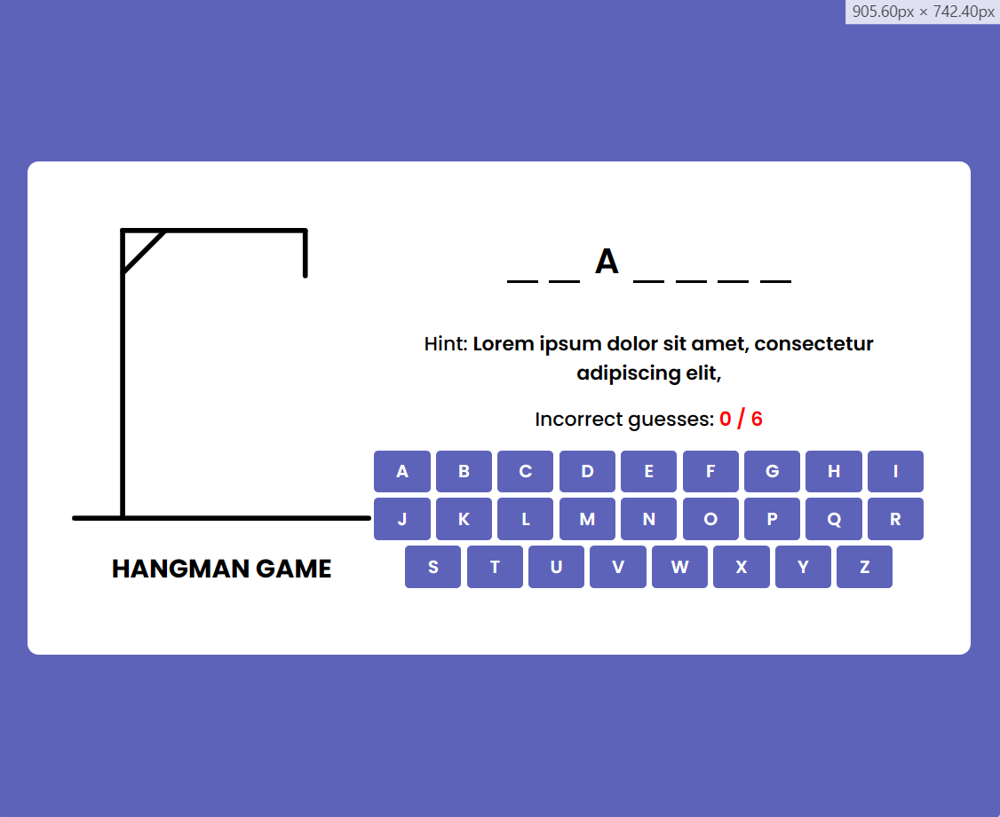

# Hangman Game JavaScript

A person thinks of a word in the traditional word-guessing game Hangman, and the other player tries to guess it by offering letters within a set number of guesses. This is a basic explanation of how to use HTML, CSS, and JavaScript to make a Hangman game.

- HTML Structure: To organize the game's interface, HTML is required. The word to be guessed, the letters that have been guessed thus far, the hangman figure, and any messages for the player are all displayed in this way.

- The hangman figure, the letter buttons, and any other visual components of the game interface are all styled using CSS.

- JavaScript logic is in charge of handling the logic of the game. This entails giving the player a random word to guess, determining whether the game is won or lost, tracking erroneous guesses, and confirming whether the letters they guessed are in the word.

## Starting With HTML & CSS

First, we need to create a file named `index.html` and here's the template code

```
<!DOCTYPE html>
<html lang="en">
<head>
    <meta charset="UTF-8">
    <meta name="viewport" content="width=device-width, initial-scale=1.0">
    <title>Hangman Game JavaScript</title>
    <link res="stylesheet" href="style.css">
</head>
<body>
    
</body>
</html>
```

And also for `style.css` to import the link from the file of **Google Fonts**. For entire game when it comes of font, we will use the style **Poppin**.

```
@import url('https://fonts.googleapis.com/css2?family=Poppins:ital,wght@0,100;0,200;0,300;0,400;0,500;0,600;0,700;0,800;0,900;1,100;1,200;1,300;1,400;1,500;1,600;1,700;1,800;1,900&display=swap');
```

The first code for `style.css` using universal `*` selector it means all kinds of elements you've created. If you want to learn more about `box-sizing`, click [this](https://www.w3schools.com/css/css3_box-sizing.asp) from W3Schools.

```
*{
    margin: 0;
    padding: 0;
    box-sizing: border-box;
    font-family: "Poppins", sans-serif;
}
```

Create the first `div` inside of the body with the class name `container`.

```
<!DOCTYPE html>
<html lang="en">
<head>
    <!-- snip -->
</head>
<body>
    <div class="container">
        
    </div>
</body>
</html>
```

Create another `div` element with the class name `hangman-box`

```
<!DOCTYPE html>
<html lang="en">
<head>
    <!-- snip -->
</head>
<body>
    <div class="container">
        <div class="hangman-box">
            
        </div>
    </div>
</body>
</html>
```

Next, is create `img` element for the first image for hangman inside of `hangman-box` class of second `div` with the `alt` attribute along its value to **hangman image**

```
<!DOCTYPE html>
<html lang="en">
<head>
    <!-- snip -->
</head>
<body>
    <div class="container">
        <div class="hangman-box">
            
        </div>
    </div>
</body>
</html>
```

The result for `div` container

<figure>
    
    <figcaption>The first `div` section, the container</figcaption>
</figure>

The result inside of `div` container which is `hangman-box`

<figure>
    
    <figcaption>The children of container</figcaption>
</figure>

The last is the image.

<figure>
    
    <figcaption>The image of the game.</figcaption>
</figure>

Add `h1` tag for the title of the game which is **Hangman Game**.

```
<!DOCTYPE html>
<html lang="en">
<head>
    <!-- snip -->
</head>
<body>
    <div class="container">
        <div class="hangman-box">
            
            <h1>Hangman Game</h1>
        </div>
    </div>
</body>
```

<figure>
    
    <figcaption>The heading as a title of the game.</figcaption>
</figure>

Next, create another children of `container` div for the letters of the game.

```
<!DOCTYPE html>
<html lang="en">
<head>
    <!-- snip -->
</head>
<body>
    <div class="container">
        <div class="hangman-box">
            
            <h1>Hangman Game</h1>
        </div>
    </div>
    <div class="game-box">
            
    </div>
</body>
```

Create the `ul` tag means unordered list for the item of letters and make seven items for it.

```
<!DOCTYPE html>
<html lang="en">
<head>
    <!-- snip -->
</head>
<body>
    <div class="container">
        <div class="hangman-box">
            
            <h1>Hangman Game</h1>
        </div>
    </div>
    <div class="game-box">
        <ul class="word-display">
            <li class="letter"></li>
            <li class="letter"></li>
            <li class="letter"></li>
            <li class="letter"></li>
            <li class="letter"></li>
            <li class="letter"></li>
            <li class="letter"></li>
        </ul>
    </div>
</body>
```

Let's see in the HTML Tree Generator in this page.

<figure>
    
    <figcaption>As you can see, the children of container, hangman-box and the game-box.</figcaption>
</figure>

Create `h4` tag for the **hint** of this game. And uset `b` tag which is the text will become `bold`

```
<!DOCTYPE html>
<html lang="en">
<head>
    <!-- snip -->
</head>
<body>
    <div class="container">
        <div class="hangman-box">
            
            <h1>Hangman Game</h1>
        </div>
    </div>
    <div class="game-box">
        <ul class="word-display">
            <li class="letter"></li>
            <li class="letter"></li>
            <li class="letter"></li>
            <li class="letter"></li>
            <li class="letter"></li>
            <li class="letter"></li>
            <li class="letter"></li>
        </ul>
        <h4 class="hint-text">
                Hint: <b>Lorem ipsum dolor sit amet, consectetur adipiscing elit,</b>
        </h4>
    </div>
</body>
```

<figure>
    
    <figcaption>The h4 tag for the hint of the game.</figcaption>
</figure>

Create another `h4` tag for the **incorrect** of this game. And uset `b` tag which is the text will become `bold`

```
<!DOCTYPE html>
<html lang="en">
<head>
    <!-- snip -->
</head>
<body>
    <div class="container">
        <div class="hangman-box">
            
            <h1>Hangman Game</h1>
        </div>
    </div>
    <div class="game-box">
        <ul class="word-display">
            <li class="letter"></li>
            <li class="letter"></li>
            <li class="letter"></li>
            <li class="letter"></li>
            <li class="letter"></li>
            <li class="letter"></li>
            <li class="letter"></li>
        </ul>
        <h4 class="hint-text">
                Hint: <b>Lorem ipsum dolor sit amet, consectetur adipiscing elit,</b>
        </h4>
        <h4 class="guesses-text">
                Incorrect guesses: <b>Lorem ipsum dolor sit amet, consectetur adipiscing elit,</b>
            </h4>
    </div>
</body>
```

<figure>
    
    <figcaption>The result of h4 for incorrect</figcaption>
</figure>

Using `button` tag create this button for this project from `a - z`

```
<div class="keyboard">
    <button>a</button><button>b</button><button>c</button><button>d</button>
    <button>e</button><button>f</button><button>g</button><button>h</button>
    <button>i</button><button>j</button><button>k</button><button>l</button>
    <button>m</button><button>n</button><button>o</button><button>p</button>
    <button>q</button><button>r</button><button>s</button><button>t</button>
    <button>u</button><button>v</button><button>w</button><button>x</button>
    <button>y</button><button>z</button>
</div>
```

<figure>
    
    <figcaption>The 26 buttons for the game</figcaption>
</figure>


Let's style for the `body` of the game.

```
body {
    display: flex;
    align-items: center;
    justify-content: center;
    min-height: 100vh;
    background: #5e63ba;
}
```

<figure>
    
    <figcaption>From white to something purple and blue</figcaption>
</figure>

This CSS code snippet is targeting the `body` element and applying several styles to it.

`display: flex`; makes the body a flex container, which allows for easy alignment and positioning of its child elements.

`align-items`: center; centers the child elements vertically within the body.

`justify-content`: center; centers the child elements horizontally within the body.

`min-height`: 100vh; sets the minimum height of the body to be the full height of the viewport.

`background`: #5e63ba; sets the background color of the body to a dark blue color represented by the hexadecimal value #5e63ba.


Next, to style the `.container` class which is the main `div` section. To know **Flexbox**, you should study this from [W3Schools - Flexbox](https://www.w3schools.com/css/css3_flexbox.asp)

```
.container {
    width: 850px;
    background: #fff;
    display: flex;
    align-items: flex-end;
    padding: 60px 40px;
    border-radius: 10px;
}
```

This CSS code snippet defines the styling for a container element. It sets the `width` to `850 pixels`, the background color to `white`, and the display to `flex` with items aligned to the `bottom`. It also adds `padding` of `60 pixels` on the top and bottom, and `40 pixels` on the left and right. The container has a `border-radius` of `10 pixels`, giving it rounded corners.

<figure>
    
    <figcaption>Here's the result of two chidlren of containers aligned two using flexbox.</figcaption>
</figure>

Let's style for the `img` tag which is one of the children of `hangman-box`

<figure>
    
</figure>

```
.hangman-box img{
    max-width: 270px;
} max-width: 270px;
```

This CSS snippet sets the maximum width of elements with the class `hangman-box` to `270 pixels`.

<figure>
    
    <figcaption>The result but, there's a problem when it comes of alignment</figcaption>
</figure>

Next, is to style the `h1` tag.

<figure>
    
    <figcaption></figcaption>
</figure>

```
.hangman-box h1 {
    font-size: 1.45rem;
    margin-top: 20px;
    text-align: center;
    text-transform: uppercase;
}
```

This CSS code snippet targets the `<h1>` element inside the `.hangman-box` class. It sets the `font size` to `1.45rem`, adds a `top margin` of `20 pixels`, `centers` the text, and `transforms` it to `uppercase`.

<figure>
    
    <figcaption>The Hangmang Game become, uppercase</figcaption>
</figure>

Let's style the `li` tag with the name of `.letter`.

<figure>
    
    <figcaption></figcaption>
</figure>

```
.word-display .letter {
    width: 28px;
    border-bottom: 3px solid #000;
}
```

This CSS code snippet targets elements with the class "letter" inside elements with the class "word-display". It sets the `width` of these elements to `28 pixels` and adds a solid black `border at the bottom` with a thickness of `3 pixels`.

<figure>
    
    <figcaption>You see the border with the color black every letter</figcaption>
</figure>


Let's style the `.word-display` (unordered list).

```
.word-display {
    display: flex;
    gap: 10px;
    list-style: none;
    align-items: center;
    justify-content: center;
}
```

This CSS code snippet defines the styling for an element with the class `"word-display"`. It sets the display property to `"flex"`, which allows the child elements to be laid out in a row or column. The `gap` property sets the space between the child elements to `10 pixels`. The `list-style` property removes the default `bullet points` or `numbering` from the list items. The `align-items` and `justify-content` properties `center` the child elements both vertically and horizontally within the container.

<figure>
    
    <figcaption>The alignment of letters and the letters bullet points are removed</figcaption>
</figure>

Type the letter `a` on the third item to style using CSS like this in `.word-display` class part.

```
<ul class="word-display">
    <li class="letter"></li>
    <li class="letter"></li>
    <li class="letter">a</li>
    <li class="letter"></li>
    <li class="letter"></li>
    <li class="letter"></li>
    <li class="letter"></li>
</ul>
```

<figure>
    
    <figcaption>As you can see, the letter 'a' in the third item. Later, it will become uppercase after we style it.</figcaption>
</figure>

Now, let's style the letter 'a' under the `.word-display` class of unordered list.

```
.word-display .letter {
    width: 28px;
    font-size: 2rem;
    font-weight: 600;
    text-transform: uppercase;
    margin-bottom: 40px;
    border-bottom: 3px solid #000;
}
```

In CSS code snippet defines the styling for elements with the class "letter" that are descendants of elements with the class "word-display". It sets the `width` of these elements to `28 pixels`, the `font size` to `2rem`, the `font weight` to `600` (bold), `transforms the text` to `uppercase`. the horizontal `alignment of text` to the `center`. So, the text will be centered within its container.

<figure>
    
    <figcaption>After styling letter `a` here's the result.</figcaption>
</figure>

Let's add another class in html file named `.guessed` in `.letter` list item.

```
<ul class="word-display">
    <li class="letter"></li>
    <li class="letter"></li>
    <li class="letter guessed">a</li>
    <li class="letter"></li>
    <li class="letter"></li>
    <li class="letter"></li>
    <li class="letter"></li>
</ul>
```

Let's style this for the alignment of letter `A` of the game. Let's go to CSS under the `.word-display`

```
.word-display .letter.guessed{
    border-color: transparent;
    margin: -40px 0 35px;
}
```

This code snippet targets elements with both classes "letter" and "guessed" inside elements with the class "word-display". It sets the `border color` to `transparent` and adjusts the `margin` to `-40` pixels from the top, `0` from the right and left, and `35 pixels` from the bottom.

<figure>
    
    <figcaption>The letter `A` was aligned after styling it.</figcaption>
</figure>

Let's style `h4` under the `.game-box` for hint and incorrect.

```
.game-box h4 {
    text-align: center;
    font-size: 1.1rem;
    font-weight: 500;
    margin-bottom: 15px;
}
```

In this CSS code snippet styles the `h4` elements that are descendants of elements with the class "game-box". It `centers` the `text`, sets the f`ont size` to `1.1 rem`, sets the `font weight` to `500` (medium), and adds a `bottom margin` of `15 pixels`.

<figure>
    
    <figcaption>In h4 which is the `hint` was aligned to center and the text have medium thick</figcaption>
</figure>

Next to style is the `b` (bold) tag. Under the `h4`

```
.game-box h4 b {
    font-weight: 600;
}
```

This CSS code snippet styles the `b` (bold) tag that is a descendant of an h4 tag within an element with the class "game-box". It sets the `font-weight` property to `600`, which makes the text appear bold.

<figure>
    
    <figcaption>The text element of `b` is bigger than the text of `h4` tag.</figcaption>
</figure>

The the color text font of `b` of `.guesses-text`.

```
.game-box .guesses-text b {
    color: #ff0000;
}
```

This CSS code snippet targets the `<b>` (bold) tag that is a descendant of an element with the class "guesses-text" within an element with the class "game-box". It sets the `color` property to #ff0000, which is the hexadecimal code for red. This means that the text inside the `<b>` tag will appear in red.

<figure>
    
    <figcaption>The text of incorrect is red</figcaption>
</figure>

Style the keyboard of the game.

```
.game-box .keyboard {
    display: flex;
    gap: 5px;
    flex-wrap: wrap;
    justify-content: center;
}
```

This CSS code snippet targets the `.keyboard` class that is a descendant of an element with the class `.game-box`. It sets the `display` property to `flex`, which allows the child elements to be laid out in a row or column. The `gap` property sets the space between the child elements to `5px`. The `flex-wrap` property `wraps` the child elements if they exceed the width of the container. The `justify-content` property `centers` the child elements horizontally within the container.

<figure>
    
    <figcaption>The keyboard button was aligned using flexbox and they have gap to each other.</figcaption>
</figure>

Style all the buttons and change their appearance.

```
.keyboard button {
    color: #fff;
    font-size: 1rem;
    font-weight: 600;
    cursor: pointer;
    outline: none;
    padding: 7px;
    border: none;
    background: #5e63ba;
    border-radius: 4px;
    text-transform: uppercase;
    width: calc(100% / 9 - 5px);
}
```

This code snippet styles the `buttons` inside an element with the class "keyboard". It sets the text `color` to `white`, `font size` to `1rem`, `font weight` to `600`, `cursor` to `pointer`, removes the `outline`, adds `padding` of `7px`, removes the `border`, sets the `background` color to `#5e63ba`, gives a `border radius` of `4px`, `transforms the text` to `uppercase`, and calculates the width based on the total width divided by 9 minus 5px.

<figure>
    
    <figcaption>The button aligned in 1 row, which is 9 buttons. Thanks for `calc` in width.</figcaption>
</figure>


Once you hover the `buttons` the color will change.

```
.keyboard button:hover{
    background: #8286c9;
}
```

This CSS snippet changes the background color of the buttons inside an element with the class "keyboard" when they are being hovered over by the user's mouse cursor. The background color will change to `#8286c9` when the button is hovered over.

<figure>
    
    <figcaption></figcaption>
</figure>

Adjust the margin of the `.keyboard` of button above to 40px;

```
.game-box .keyboard {
    display: flex;
    gap: 5px;
    margin-top: 40px; // new update
    flex-wrap: wrap;
    justify-content: center;
}
```

This CSS code snippet sets the `top margin` of an element to `40 pixels`.

<figure>
    
    <figcaption>The margin of top is 40px</figcaption>
</figure>

Add additional `div` for the modal of the game.

```
    <div class="game-modal">
        <div class="content">
            
        </div>
    </div>
```

This HTML code snippet creates a modal (a pop-up window) for a game. The modal is represented by a `<div>` element with the class "game-modal". Inside the modal, there is another `<div>` element with the class "content". Inside the content, there is an `` element that displays an image with the source "images/lost.gif" and an alternative text "gif". This image could be used to show a lost game scenario, for example.

<figure>
    
    <figcaption></figcaption>
</figure>

Update the `.game-modal` to add another declarator.

```
    <div class="game-modal">
        <div class="content">
            
            <h4>Game Over!</h4>
            <p>The correct word was : <b>rainbow</b></p>
            <button class="play-again">Play Again</button>
        </div>
    </div>
```

This HTML code snippet creates a modal (a pop-up window) for a game. The modal is represented by a `<div>` element with the class "game-modal". Inside the modal, there is another `<div>` element with the class "content". Inside the content, there is an `` element that displays an image with the source "images/lost.gif" and an alternative text "gif". This image could be used to show a lost game scenario, for example. Below the image, there is an `<h4>` element that displays the text "Game Over!" and a `<p>` element that displays the text "The correct word was : rainbow". Finally, there is a `<button>` element with the class "play-again" that displays the text "Play Again".

Let's style the `.game-modal` class to fixed.

```
.game-modal {
    position: fixed;
}
```

This CSS code snippet styles the `.game-modal` class by setting its `position` property to `fixed`. This means that the element with the `.game-modal` class will be positioned relative to the viewport, staying in the same position even when the page is scrolled.

<figure>
    
    <figcaption>remaining at the same spot despite page scrolling</figcaption>
</figure>

`.game-modal img` to style the maximum width of image.

```
.game-modal img {
    max-width: 130px;
}
```

This CSS code snippet targets the `img` elements that are descendants of an element with the class "game-modal". It sets the `maximum width` of those images to `130 pixels`.

<figure>
    
    <figcaption></figcaption>
</figure>

Style the `content` of the game and put the background color for this.

```
.game-modal .content {
    background: #fff;
    max-width: 420px;
    width: 100%;
}
```

This code sets the background of the `content` inside an element with the class "game-modal" to `white` (#fff). It limits the `maximum width` of the content to `420 pixels` and makes the `width` of the content `100% `of its container.

<figure>
    
    <figcaption>his code sets the background of the `content` inside an element with the class "game-modal"</figcaption>
</figure>

Update the `.game-modal` declarators

```
.game-modal {
    position: fixed;
    left: 0;
    top: 0;
    width: 100%;
    height: 100%;
    display: flex;
    align-items: center;
    justify-content: center;
    background: rgba(0, 0, 0, 0.6);
}
```

This CSS code snippet styles the .game-modal class. It sets the `position` of the element to `fixed`, meaning it will be positioned relative to the viewport and stay in the same position even when the page is scrolled. It is `positioned` at the top left corner of the viewport (left: 0; top: 0;), spanning the entire `width` and `height` of the viewport (width: 100%; height: 100%;). It uses flexbox layout to center its child elements both vertically and horizontally (display: flex; align-items: center; justify-content: center;). The `background color` of the modal is a semi-transparent black (background: rgba(0, 0, 0, 0.6);), giving it a dimmed effect.

<figure>
    
    <figcaption></figcaption>
</figure>

Update the `.content` under the `.game-modal` which is the descendant.

```
.game-modal .content {
    background: #fff;
    max-width: 420px;
    width: 100%;
    text-align: center;
    border-radius: 10px;
    padding: 30px;
}
```

This CSS code snippet styles the content of a game modal. It sets the background color to white, sets a maximum width of 420 pixels, ensures the content is centered horizontally, adds rounded corners to the content, and adds `padding` of `30 pixels`.

<figure>
    
    <figcaption>The result with padding and the border is smooth</figcaption>
</figure>

Style the `h4` of the descendant of `.game-modal` to adjust the font-size.

```
.game-modal h4 {
    font-size: 1.53rem;
}
```

<figure>
    
    <figcaption>The h4 which is "Game Over!" become big</figcaption>
</figure>

Style the `p` of the descendant of `.game-modal` to adjust the font-size, margin and the weight of font.

```
.game-modal p {
    font-size: 1.15rem;
    margin: 15px 0 30px;
    font-weight: 500;
}
```

This CSS code snippet styles the `p` elements that are descendants of elements with the class "game-modal". It sets the `font-size` to 1.15rem, adds a margin of `15px` from the top and bottom, and `30px` from the top, and sets the `font-weight` to `500` (medium).

<figure>
    
    <figcaption>The new design of game modal of the game</figcaption>
</figure>

Style the `b` of the descendant of `.game-modal` and the children of `p` to apply the color font and font-weight.

```
.game-modal p b {
    color: #5e63ba;
    font-weight: 600;
}
```

This CSS code snippet styles the `<b>` (bold) tags that are descendants of `<p>` tags within elements with the class "game-modal". It sets the `color` property to `#5e63ba` (a shade of purple) and the `font-weight` property to `600` (bold).

<figure>
    
    <figcaption>Look at the text of random the color is something purple</figcaption>
</figure>

Style the `button` tag which is the descendant of `game-modal`.

```
.game-modal button {
    padding: 12px 23px;
}
```

This CSS snippet targets all button elements within elements with the class "game-modal" and sets their `padding` to `12 pixels` on the top and bottom, and `23 pixels` on the left and right.

<figure>
    
    <figcaption>Padding for button works properly</figcaption>
</figure>

This CSS code snippet targets buttons that are descendants of elements with either the class `game-modal` or `keyboard`. It styles these buttons with the following properties:

- `color`: sets the text color to white (#fff).
- `font-size`: sets the font size to 1rem.
- `font-weight`: sets the font weight to 600.
- `cursor`: sets the cursor to a pointer, indicating the button is clickable.
- `outline`: removes any default outline from the button.
- `border`: removes any border from the button.
- `background`: sets the background color to a dark purple (#5e63ba).
- `border-radius`: sets the border radius to 4 pixels.
- `text-transform`: capitalizes the text within the button.

```
:where(.game-modal, .keyboard) button {
    color: #fff;
    font-size: 1rem;
    font-weight: 600;
    cursor: pointer;
    outline: none;
    border: none;
    background: #5e63ba;
    border-radius: 4px;
    text-transform: uppercase;
}
```

This CSS code snippet styles the buttons inside an element with the class "keyboard". It sets the `padding` of the buttons to `7 pixels` on all sides and calculates the `width` of each button as a fraction of the total width of the keyboard container, minus `5 pixels` for spacing between buttons.

```
.keyboard button {
    padding: 7px;
    width: calc(100% / 9 - 5px);
}
```

<figure>
    
    <figcaption>The button become purple</figcaption>
</figure>

This code snippet targets the button elements inside elements with the classes .game-modal or .keyboard when they are being hovered over by the user. It changes the background color of the buttons to #8286c9 when they are hovered.

```
:where(.game-modal, .keyboard) button:hover{
    background: #8286c9;
}
```

<figure>
    
    <figcaption>Once the mouse pointer hovers the button "Play Again"</figcaption>
</figure>

This CSS code snippet defines the styling for a modal element with the class .game-modal. It is initially hidden (display: none).

```
.game-modal {
    position: fixed;
    left: 0;
    top: 0;
    width: 100%;
    height: 100%;
    display: none; // hidden game-modal
    align-items: center;
    justify-content: center;
    background: rgba(0, 0, 0, 0.6);
}
```

<figure>
    
    <figcaption>The modal game is hidden</figcaption>
</figure>

Update the project's padding of `body` to adjust its padding.

This CSS code snippet styles the body element of a webpage. The padding: 0 10px property adds 10 pixels of padding to the left and right sides of the body.

```
body {
    display: flex;
    align-items: center;
    padding: 0 10px; // padding of body!
    justify-content: center;
    min-height: 100vh;
    background: #5e63ba;
}
```

<figure>
    
    <figcaption></figcaption>
</figure>

Adjust the gap between the image and the hangman word.

This CSS code snippet defines the styling for a container element with the class .container.

- `gap`: 70px; sets the gap between child elements of the container to 70 pixels.

```
.container {
    width: 850px;
    background: #fff;
    display: flex;
    gap: 70px; // the gap
    align-items: flex-end;
    padding: 60px 40px;
    border-radius: 10px;
}
```

<figure>
    
    <figcaption>The gaps between the image and the hangman word work.</figcaption>
</figure>

This CSS code snippet contains a media query that applies styles when the viewport width is at most 782px. It changes the layout of the `.container` element to be a column, adds padding, and centers its child elements. It also sets the maximum width of the image inside `.hangman-box` to `200px` and hides the `h1` element inside `.hangman-box` at that specific viewport width.

<figure>
    
    <figcaption>Once you resize the project webpage, it will happen </figcaption>
</figure>

## Getting Into JavaScript

Create the file `script.js` for the functionality of the project then link it to the html file here's the command below with the explanation.

This HTML code snippet includes a JavaScript file named `script.js` with the `defer` attribute, which tells the browser to load the script after parsing the HTML document.

<figure>
    
    <figcaption>Here's the file of script.js under the scripts file.</figcaption>
</figure>

```
<script src="./scripts/script.js" defer></script>
```

Delete all the `buttons` in html file for `.keyboard` class div section.

```
<!DOCTYPE html>
<html lang="en">
<head>
    <meta charset="UTF-8">
    <meta name="viewport" content="width=device-width, initial-scale=1.0">
    <title>Hangman Game JavaScript</title>
    <link rel="stylesheet" href="style.css">
    <script src="./scripts/script.js" defer></script>
</head>
<body>
    <div class="game-modal">
        <div class="content">
            
            <h4>Game Over!</h4>
            <p>The correct word was : <b>rainbow</b></p>
            <button class="play-again">Play Again</button>
        </div>
    </div>
    <div class="container">
        <div class="hangman-box">
            
            <h1>Hangman Game</h1>
        </div>
        <div class="game-box">
            <ul class="word-display">
                <li class="letter"></li>
                <li class="letter"></li>
                <li class="letter guessed">a</li>
                <li class="letter"></li>
                <li class="letter"></li>
                <li class="letter"></li>
                <li class="letter"></li>
            </ul>
            <h4 class="hint-text">
                Hint: <b>Lorem ipsum dolor sit amet, consectetur adipiscing elit,</b>
            </h4>
            <h4 class="guesses-text">
                Incorrect guesses: <b>0 / 6</b>
            </h4>
            <div class="keyboard"></div>
        </div>
    </div>
</body>
</html>
```

<figure>
    
    <figcaption>When we erase the `button` that why no buttons while we develop this project.</figcaption>
</figure>

## Creating Interactive

Create the first code for `script.js` file.

This code iterates over ASCII values from `97` to `122`, which correspond to lowercase letters '`a`' to '`z`'. It converts each ASCII value to its corresponding character and logs it to the console.

```
for (let i = 97; i <= 122; i++){
    console.log(String.fromCharCode(i));
}
```

<figure>
    
    <figcaption>Here's the result in the console from a to z.</figcaption>
</figure>

This JavaScript code snippet creates buttons dynamically and logs the corresponding lowercase alphabetic characters to the console.

The loop iterates from ASCII value 97 (which corresponds to the character 'a') to 122 (which corresponds to the character 'z'). For each iteration, a new button element is created using `document.createElement("button")`. The character corresponding to the current ASCII value is obtained using `String.fromCharCode(i)` and logged to the console using `console.log()`.

```
for (let i = 97; i <= 122; i++){
    const button = document.createElement("button");
    console.log(String.fromCharCode(i));
}
```

<figure>
    
    <figcaption>Here's the result in the console from a to z.</figcaption>
</figure>

Now, to update the code to add the button as a chile of `.keyboard` class. Once you type the `keyboardDiv` which is the constant variable, here's the result to put the button as children.

<figure>
    
    <figcaption>Here's the result to the console when we type the keyboardDiv which later we put the buttons as its children</figcaption>
</figure>

This code selects an HTML element with the class "keyboard" and creates a set of buttons inside it. The buttons are created based on the ASCII values of lowercase letters (97 to 122). Each button displays the corresponding lowercase letter. The buttons are appended as children of the "keyboard" element.

This JavaScript code is selecting the HTML element with the class name "keyboard" from the current document and assigning it to the constant variable `keyboardDiv`. The `querySelector` method is used to select the first element that matches the specified CSS selector. In this case, it selects the first element with the class name "keyboard".

```
const keyboardDiv = document.querySelector(".keyboard");

for (let i = 97; i <= 122; i++){
    const button = document.createElement("button");
    button.innerText = String.fromCharCode(i);
    keyboardDiv.appendChild(button);
}
```

<figure>
    
    <figcaption>The gaps between the image and the hangman word works.</figcaption>
</figure>

## Displaying a Random Word and Hint

Let's create a word list and show a random word and hint here.

Update the program for `script.js`. Create the function constant named `getRandomWord` Here's the command in below:

This JavaScript code snippet defines a function called `getRandomWord`. When this function is called, it selects a random word from an array called `wordList`. It uses the `Math.random()` function to generate a random number between 0 and 1 and then multiplies it by the length of `wordList` to get a random index. It then uses array destructuring to extract the `word` and `hint` properties from the object at that index in the `wordList` array. Finally, it logs the `word` and `hint` to the console.

```
const getRandomWord = () => {
    const {word, hint} = wordList[Math.floor(Math.random() * wordList.length)];
    console.log(word, hint);
}
```

<figure>
    
    <figcaption>The sample word with hint</figcaption>
</figure>

Next, is to link the `word-list.js` to html file.

```
<script src="./scripts/script.js" defer></script>
<script src="./scripts/word-list.js"></script>
```

This JS code defines a function `getRandomWord` that selects a random word and hint from an array `wordList`. It logs the word to the console and sets the `innerText` of the `<b>` element inside an element with the class `hint-text` to the hint.

```
const getRandomWord = () => {
    const {word, hint} = wordList[Math.floor(Math.random() * wordList.length)];
    console.log(word);
    document.querySelector(".hint-text b").innerText = hint;
}
```

<figure>
    
    <figcaption>Here's the demo for random hint</figcaption>
</figure>

This code snippet does the following:

1. It selects the elements with the classes "word-display" and "keyboard" from the HTML document.

2. It defines a function `getRandomWord` that does the following:
    - It selects a random word and hint from an array called `wordList`.
    - It logs the selected word to the console.
    - It sets the inner text of an element with the class "hint-text" to the selected hint.
    - It updates the inner HTML of an element with the class "word-display" to display the selected word as a list of letters, each wrapped in an `<li>` element with the class "letter".

```
const wordDisplay = document.querySelector(".word-display");
const keyboardDiv = document.querySelector(".keyboard");

const getRandomWord = () => {
    const {word, hint} = wordList[Math.floor(Math.random() * wordList.length)];
    console.log(word);
    document.querySelector(".hint-text b").innerText = hint;
    wordDisplay.innerHTML = word.split("").map(() => `<li class="letter"></li>`).join("");
}
```

Delete all the `li` inside of `.word-display` which is unordered list.

<figure>
    
    <figcaption>After you delete the li items for blank word.</figcaption>
</figure>

<figure>
    
    <figcaption>The result for the black word</figcaption>
</figure>

## Checking if Clicked Letter Matches the Word

Let's check if the clicked letter exists in the word or not.

Update the code in `for` loop to add `addEventListener()` method.

```
const initGame = (button, clickedLetter) => {
    console.log(button, clickedLetter);
}

// Create keyboard buttons and adding event listeners
for (let i = 97; i <= 122; i++){
    const button = document.createElement("button");
    button.innerText = String.fromCharCode(i);
    keyboardDiv.appendChild(button);
    button.addEventListener("click", e => initGame(e.target, String.fromCharCode(i)));
}
```

This JavaScript code is creating a dynamic keyboard of lowercase alphabetic buttons and adding event listeners to each button.

The `initGame` function logs the clicked button and the letter it represents to the console.

The `for` loop iterates over ASCII values from 97 to 122, which correspond to lowercase letters 'a' to 'z'. For each iteration, a new button element is created using `document.createElement("button")`. The character corresponding to the current ASCII value is obtained using `String.fromCharCode(i)` and set as the button's inner text. The button is then appended to the `keyboardDiv` element.

An event listener is added to each button using `button.addEventListener`. When a button is clicked, the initGame function is called with the clicked button (e.target) and the letter it represents (`String.fromCharCode(i)`).

<figure>
    
    <figcaption>Once you type all the buttons here, the console will appear the tag and the letter.</figcaption>
</figure>

Add another variable for the game named `currentword`

```
let currentWord;
```

Declare the `currentWord` variable to `word` in this code.

```
const getRandomWord = () => {
    const {word, hint} = wordList[Math.floor(Math.random() * wordList.length)];
    currentWord = word; // <- this variable
    console.log(word);
    document.querySelector(".hint-text b").innerText = hint;
    wordDisplay.innerHTML = word.split("").map(() => `<li class="letter"></li>`).join("");
}
```

Update the `initGame` the check if your type exists in the random word.

This code defines a function `initGame` that checks if the `clickedLetter` is part of the `currentWord`. If it is, it logs that the letter exists in the word. Otherwise, it logs that the letter does not exist in the word.

```
const initGame = (button, clickedLetter) => {
    // Checking if clickedLetter is exist on the current word
    if(currentWord.includes(clickedLetter)){
        console.log(clickedLetter, " is exist on the word");
    } else {
        console.log(clickedLetter, " is not exist on the word");
    }
}
```

<figure>
    
    <figcaption>Check if the letter exists in the word of guitar</figcaption>
</figure>

Now, update the code we created earlier in this.

```
const initGame = (button, clickedLetter) => {
    // Checking if clickedLetter is exist on the current word
    if(currentWord.includes(clickedLetter)){
        // Showing all correct letters on the word display
    [...currentWord].forEach((letter, index) => {
        if(letter === clickedLetter){
            wordDisplay.querySelectorAll("li")[index].innerText = letter;
            wordDisplay.querySelectorAll("li")[index].classList.add("guessed");
        }
    });
    } else {
        console.log(clickedLetter, " is not exist on the word");
    }
}
```

This JavaScript function, `initGame`, is used to initialize a game of Hangman. It takes two parameters: `button` and `clickedLetter`.

The function checks if the `clickedLetter` exists in the `currentWord`. If it does, it iterates over each letter in `currentWord` and if a letter matches `clickedLetter`, it updates the corresponding list item (`<li>`) in the `wordDisplay` to show the correct letter and adds a class of "guessed" to it.

If the `clickedLetter` does not exist in currentWord, it logs a message to the console saying the letter is not present in the word.

The purpose of this function is to update the game state based on the player's guesses.

<figure>
    
    <figcaption>Check if the letter is exist in the word of Pizza like you see in the sample</figcaption>
</figure>

Update the variable we create earlier.

```
let currentWord, wrongGuestCount = 0;
const maxGuesses = 6;
```

Update and change from the `console.log` to `wrongGestCount++`.

This JavaScript line of code is incrementing the value of the `wrongGuestCount` variable by 1. It's a shorthand way of writing `wrongGuestCount = wrongGuestCount + 1`;. This is typically used in a game where each incorrect guess by the player is counted and stored in the `wrongGuestCount` variable.

```
const initGame = (button, clickedLetter) => {
    // Checking if clickedLetter is exist on the current word
    if(currentWord.includes(clickedLetter)){
        // Showing all correct letters on the word display
    [...currentWord].forEach((letter, index) => {
        if(letter === clickedLetter){
            wordDisplay.querySelectorAll("li")[index].innerText = letter;
            wordDisplay.querySelectorAll("li")[index].classList.add("guessed");
        }
    });
    } else {
        wrongGuestCount++; // <-- The code
    }
}
```

Next, is to add another constant variable named `guessesText`

This JavaScript line of code is selecting an HTML element with the class "guesses-text" and then selecting its child element of type `<b>`. The selected element is then assigned to the variable `guessesText`. This is typically used to manipulate or update the content of the selected HTML element later in the code.

```
const wordDisplay = document.querySelector(".word-display");
const guessesText = document.querySelector(".guesses-text b"); // <-- The new variable
const keyboardDiv = document.querySelector(".keyboard");
```

Add new code for the `initGame` function for the mistake updates.

This JavaScript line of code is updating the text content of an HTML element with the class name "guesses-text". It sets the text to display the current number of incorrect guesses (`wrongGuestCount`) and the maximum number of guesses allowed (`maxGuesses`). The `${}` syntax is used to interpolate the values of the variables into the string.

```
const initGame = (button, clickedLetter) => {
    // Checking if clickedLetter is exist on the current word
    if(currentWord.includes(clickedLetter)){
        // Showing all correct letters on the word display
    [...currentWord].forEach((letter, index) => {
        if(letter === clickedLetter){
            wordDisplay.querySelectorAll("li")[index].innerText = letter;
            wordDisplay.querySelectorAll("li")[index].classList.add("guessed");
        }
    });
    } else {
        wrongGuestCount++;
    }
    guessesText.innerText = `${wrongGuestCount} / ${maxGuesses}`; // <--- The new code!
}
```

<figure>
    
    <figcaption>Here's the sample how the incorrect works</figcaption>
</figure>

Add another constant variable for the hangman image.

This code snippet selects an image element inside an element with the class "hangman-box" using the `querySelector` method and assigns it to the variable `hangmanImage`.

```
const hangmanImage = document.querySelector(".hangman-box img"); // <-- new var
const wordDisplay = document.querySelector(".word-display");
const guessesText = document.querySelector(".guesses-text b");
const keyboardDiv = document.querySelector(".keyboard");
```

Next, is for the image functionality, here's the code and update the `initGame` function.

```
const initGame = (button, clickedLetter) => {
    // Checking if clickedLetter is exist on the current word
    if(currentWord.includes(clickedLetter)){
        // Showing all correct letters on the word display
    [...currentWord].forEach((letter, index) => {
        if(letter === clickedLetter){
            wordDisplay.querySelectorAll("li")[index].innerText = letter;
            wordDisplay.querySelectorAll("li")[index].classList.add("guessed");
        }
    });
    } else {
        // If clicked letter doesn't exist then update the wrongGuessCount and hangman image
        wrongGuestCount++;
        hangmanImage.src = `images/hangman-${wrongGuestCount}.svg`
    }
    guessesText.innerText = `${wrongGuestCount} / ${maxGuesses}`;
}
```

This JavaScript code snippet is setting the src attribute of an HTML image element (`hangmanImage`) to a specific SVG image file based on the value of `wrongGuestCount`.

The SVG image file is named hangman-{`wrongGuestCount`}.svg, where {`wrongGuestCount`} is a dynamic value representing the number of incorrect guesses in a game of hangman.

For example, if `wrongGuestCount` is `2`, the image source will be `images/hangman-2.svg`. This is likely used to display the current state of the hangman game, with each incorrect guess leading to an increment in the `wrongGuestCount` and consequently the displayed hangman image.

<figure>
    
    <figcaption>How the image of hangman works!</figcaption>
</figure>

Once again, update the `initGame` function to add `button.disabled = true`

This code disables the button element, making it unclickable and visually indicating that it's not active.

```
const initGame = (button, clickedLetter) => {
    // Checking if clickedLetter is exist on the current word
    if(currentWord.includes(clickedLetter)){
        // Showing all correct letters on the word display
    [...currentWord].forEach((letter, index) => {
        if(letter === clickedLetter){
            wordDisplay.querySelectorAll("li")[index].innerText = letter;
            wordDisplay.querySelectorAll("li")[index].classList.add("guessed");
        }
    });
    } else {
        wrongGuestCount++;
        hangmanImage.src = `images/hangman-${wrongGuestCount}.svg`
    }
    button.disabled = true; // <--- new code for disabling buttons once the game is over!
    guessesText.innerText = `${wrongGuestCount} / ${maxGuesses}`;
}
```

Go to the CSS file and type this code for the indicate when you type the button letter it will be disabled and the color will changed.

This CSS code targets disabled buttons within an element with the class "keyboard" and sets their `opacity` to `0.6`, making them semi-transparent, and `disables` `pointer events` on them, making them `unclickable`.

```
.keyboard button[disabled]{
    opacity: 0.6;
    pointer-events: none;
}
```

<figure>
    
    <figcaption>Once you pressed already the button, the button will be disabled and change the color of buttons</figcaption>
</figure>


## Implementing the Game Over Functionality

Let's show the modal on game over or victory.

First, we need to do is to update the variables we create earlier

```
let currentWord, correctLetters = [] ,wrongGuestCount = 0;
const maxGuesses = 6;
```

Update the `initGame` function to add a condition.

```
const initGame = (button, clickedLetter) => {
    // Checking if clickedLetter is exist on the current word
    if(currentWord.includes(clickedLetter)){
        // Showing all correct letters on the word display
    [...currentWord].forEach((letter, index) => {
        if(letter === clickedLetter){
            correctLetters.push(letter); // <--- new code
            wordDisplay.querySelectorAll("li")[index].innerText = letter;
            wordDisplay.querySelectorAll("li")[index].classList.add("guessed");
        }
    });
    } else {
        wrongGuestCount++;
        hangmanImage.src = `images/hangman-${wrongGuestCount}.svg`
    }
    button.disabled = true;
    guessesText.innerText = `${wrongGuestCount} / ${maxGuesses}`;

    if(wrongGuestCount === maxGuesses) return gameOver(false); // new code!
    if(correctLetters.length === currentWord.length) return gameOver(true); // new code!
}
```
This JavaScript line of code is adding the `letter` to the `correctLetters` array. The `push()` method is used to add elements to the end of an array.

Next, this JavaScript code is used in a game, likely a hangman game, where `wrongGuestCount` represents the number of incorrect guesses made by the player, and `maxGuesses` is the maximum number of allowed incorrect guesses.

The first line checks if the number of incorrect guesses (`wrongGuestCount`) equals the maximum number of allowed guesses (`maxGuesses`). If this condition is met, it calls the `gameOver` function with `false` as an argument, indicating that the player has lost the game.

The second line checks if the number of correctly guessed letters (`correctLetters.length`) equals the length of the current word (`currentWord.length`). If this condition is met, it calls the `gameOver` function with `true` as an argument, indicating that the player has won the game.

In both cases, if the conditions are met, the function returns immediately, ending the game.

Next, is to add another constant variable for the `.game-modal`

```
const hangmanImage = document.querySelector(".hangman-box img");
const wordDisplay = document.querySelector(".word-display");
const guessesText = document.querySelector(".guesses-text b");
const keyboardDiv = document.querySelector(".keyboard");
const gameModal = document.querySelector(".game-modal"); // new code!
```

This code snippet assigns the first element with the class "game-modal" found in the HTML document to the variable `gameModal`. It uses the `querySelector` method to select the element and the `.` prefix to specify that it is a class selector.

Next, create the variable named `gameOver` function and here's the code with explanation.

```
const gameOver = (isVictory) => {
    setTimeout(() => {
        gameModal.classList.add("show");
    }, 300)
}
```

This JavaScript function `gameOver` is used to handle the end of a game. It takes a boolean argument `isVictory` which indicates whether the game was won or lost.

Inside the function, it uses `setTimeout` to delay the execution of the code inside the callback function by `300` milliseconds. After the delay, it adds the CSS class "show" to the `gameModal` element, presumably to display a modal or dialog box indicating the end of the game.

The modal's visibility is likely controlled by CSS styles, with the "show" class likely having styles that make it visible when applied.

Go back to CSS add another selector and update the `.game-modal` as well:

```
.game-modal {
    position: fixed;
    left: 0;
    top: 0;
    width: 100%;
    height: 100%;
    opacity: 0;  // new
    pointer-events: none;  // new
    z-index: 999;  // new
    display: flex;  // change from none to flex
    align-items: center;
    justify-content: center;
    background: rgba(0, 0, 0, 0.6);
}

.game-modal.show{
    opacity: 1;
    pointer-events: auto;
}
```

This code of `game-modal` styles an element with the class "game-modal" as a fixed position overlay covering the entire viewport. It sets the opacity to 0, making it invisible, disables pointer events, centers the content both vertically and horizontally, and transitions the opacity over 0.4 seconds for a smooth effect.

This CSS code of `game-modal.show` is defining a style rule for an element with the class "game-modal" that also has the class "show".

When this rule is applied, it changes the opacity of the element to 1, making it fully visible. It also enables pointer events on the element, allowing it to respond to user interactions such as clicks.

In other words, when an element has both the "game-modal" and "show" classes, it will be fully visible and interactive with users.

<figure>
    
    <figcaption>Once the maxguess (6x) is enough, the modal will appear</figcaption>
</figure>

Update the `gameOver` function and here's the explanation after code.

This JavaScript function `gameOver` is used to handle the end of a game. It takes a boolean argument `isVictory` which indicates whether the game was won or lost.

Inside the function, it uses setTimeout to delay the execution of the code inside the callback function by `300` milliseconds. After the delay, it sets the `src` attribute of an image element inside the gameModal to a specific GIF image file based on the value of `isVictory`. It also sets the text of an `h4` element inside the `gameModal` to either "Congrats!" or "Game Over!" based on the value of `isVictory`.

Finally, it sets the innerHTML of a `p` element inside the `gameModal` to a string that includes the `modalText` and the `currentWord` variables. It then adds the CSS class "show" to the `gameModal` element, presumably to display a modal or dialog box indicating the end of the game.

The modal's visibility is likely controlled by CSS styles, with the "show" class likely having styles that make it visible when applied.

```
const gameOver = (isVictory) => {
    setTimeout(() => {
        const modalText = isVictory ? `You found the word:` : `The correct word was:`;
        gameModal.querySelector("img").src = `images/${isVictory ? 'victory' : 'lost'}.gif`;
        gameModal.querySelector("h4").innerText = `${isVictory ? 'Congrats!' : 'Game Over!'}`;
        gameModal.querySelector("p").innerHTML = `${modalText} <b>${currentWord}</b>`;
        gameModal.classList.add("show");
    }, 300)
}
```

<figure>
    
    <figcaption>If Win in the game!</figcaption>
</figure>

<figure>
    
    <figcaption>If Lose in the game!</figcaption>
</figure>

## Resetting the game for play again

Create another constant variable named `playAgain` query selector to `.play-again`

This line of code selects an HTML element with the class name "play-again" using the `querySelector` method and assigns it to the variable `playAgainBtn`.

```
const hangmanImage = document.querySelector(".hangman-box img");
const wordDisplay = document.querySelector(".word-display");
const guessesText = document.querySelector(".guesses-text b");
const keyboardDiv = document.querySelector(".keyboard");
const gameModal = document.querySelector(".game-modal");
const playAgain = document.querySelector(".play-again"); // new variable
```

Next is to create a command for functionality of `playAgain` button.

This JavaScript code snippet adds a click event listener to the `playAgainBtn` element. When the button is clicked, it triggers the `getRandomWord` function. This function is likely used in a game where clicking the button resets the game and selects a new random word.

```
// Create keyboard buttons and adding event listeners
for (let i = 97; i <= 122; i++){
    const button = document.createElement("button");
    button.innerText = String.fromCharCode(i);
    keyboardDiv.appendChild(button);
    button.addEventListener("click", e => initGame(e.target, String.fromCharCode(i)));
}

getRandomWord();
playAgainBtn.addEventListener("click", getRandomWord); // new code
```

Update the code for `getRandomWord` function to add `resetGame` function create its statement.

```
const getRandomWord = () => {
    const {word, hint} = wordList[Math.floor(Math.random() * wordList.length)];
    currentWord = word;
    console.log(word);
    document.querySelector(".hint-text b").innerText = hint;
    resetGame(); // new function!
    wordDisplay.innerHTML = word.split("").map(() => `<li class="letter"></li>`).join("");
}
```

The `resetGame` statement


This JavaScript function, `resetGame`, is used to reset the state of a game, typically a hangman game. It does the following:

- It clears the `correctLetters` array, which likely keeps track of the correctly guessed letters in the current game.

- It resets the `wrongGuestCount` to 0, indicating that there have been no wrong guesses so far.

- It updates the `wordDisplay` element, which likely represents the current word being guessed, by setting its HTML content to a list of empty letters. Each letter is represented by an `<li>` element with the class "letter".

- It removes the "show" class from the `gameModal` element, which likely controls the visibility of the game's modal or dialog box. This typically hides the modal.

```
const resetGame = () => {
    correctLetters = [];
    wrongGuestCount = 0;
    wordDisplay.innerHTML = word.split("").map(() => `<li class="letter"></li>`).join("");
    gameModal.classList.remove("show");
}
```

Update once again the `resetGame()` function for the functionality of the images, resetting and new random word.

This JavaScript function `resetGame` is used to reset the state of a game. It does the following:

1. Empties the `correctLetters` array.

2. Resets the `wrongGuestCount` to 0.

3. Updates the `hangmanImage` source to an SVG image corresponding to the current wrongGuestCount.

4. Updates the `guessesText` to display the current `wrongGuestCount` and `maxGuesses`.

5. Enables all buttons in the `keyboardDiv`.

6. Resets the `wordDisplay` by splitting the `currentWord` into individual letters and creating list items for each letter.

7. Removes the "show" class from the `gameModal`, likely hiding it.

In summary, it resets the game to its initial state.

```
const resetGame = () => {
    correctLetters = [];
    wrongGuestCount = 0;
    hangmanImage.src = `images/hangman-${wrongGuestCount}.svg`
    guessesText.innerText = `${wrongGuestCount} / ${maxGuesses}`;
    keyboardDiv.querySelectorAll("button").forEach(btn => btn.disabled = false);
    wordDisplay.innerHTML = currentWord.split("").map(() => `<li class="letter"></li>`).join("");
    gameModal.classList.remove("show");
}
```

Here's the result when you play this game.

<figure>
    
    <figcaption>When you are winner or loser in this game result</figcaption>
</figure>

Apply the padding for game modal here's the image before

<figure>
    
    <figcaption>The game modal without padding, when it shrinks you see the modal without padding</figcaption>
</figure>

Update the CSS file for padding in `.game-modal`

```
.game-modal {
    position: fixed;
    left: 0;
    top: 0;
    width: 100%;
    height: 100%;
    opacity: 0;  
    padding: 0 10px; // new add declarator!
    pointer-events: none;
    z-index: 999;
    display: flex;
    align-items: center;
    justify-content: center;
    background: rgba(0, 0, 0, 0.6);
    transition: opacity 0.4s ease;
}
```

This CSS code snippet sets the `padding` of an element to `0 pixels` on the top and bottom, and `10 pixels` on the left and right.

<figure>
    
    <figcaption>The game modal with padding for left and right in 10 pixels.</figcaption>
</figure>

Here's the project and Congrats if you made it!

<figure>
    
    <figcaption>The full project</figcaption>
</figure>
